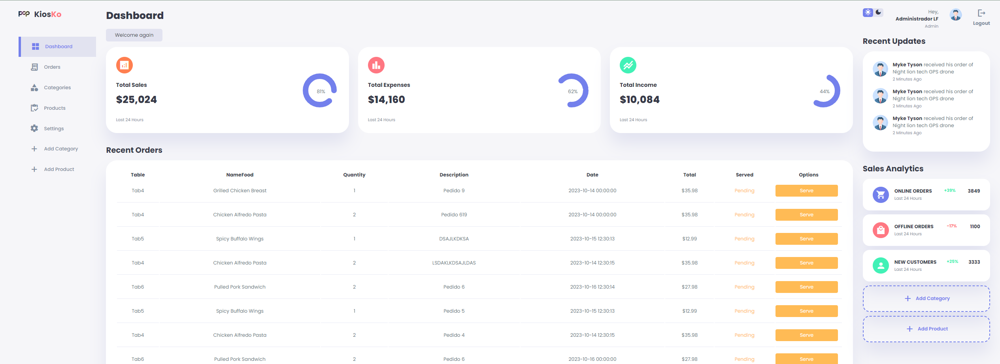

# Dashboard



## Install packages to create ENV

```bash
pip install virtualenv
```
# Enviroment ENV

### Create virtual environment

```bash
python -m venv env
```

### Activate Virtual Environment

```bash
.\env\Scripts\activate
```
# Packages
### Packages essential to init project
```bash
pip install flask-WTF
pip install flask-mysqldb
pip install Flask
pip install Flask-Login

```

### Install requeriments.txt
```bash
pip install -r requirements.txt
```

### Packages compatibles
```bash
pip uninstall Werkzeug 
pip install Werkzeug==2.3.0
```

# Run APP
### run app.py
```bash
python .\src\app.py
```

# Execute as TaskWindows

## Create File.bat Example Content
```bash
"C:\Program Files\Python311\path python.exe" "C:\Users\UserLF\...\Kiosko\src\app.py"
```

## Open Automatically with Chrome

```bash
@echo off
start "App" "C:\Program Files\Python311\python.exe" "C:\Users\josec\OneDrive\Escritorio\Kiosko\src\app.py"
timeout /t 10 /nobreak > NUL
start chrome http://127.0.0.1:4000
```

### Create Simple task 

When you start the operating system, it's recommended to give it a delay of one minute to start, the file.bat path that has to be executed is passed


# Server(working)

### Working to Apache Server WSGI
```bash
pip install mod-wsgi
```
### Apache Download
```bash
https://www.apachelounge.com/download/
```

### Kiosko

Application together with Flutter Project.


